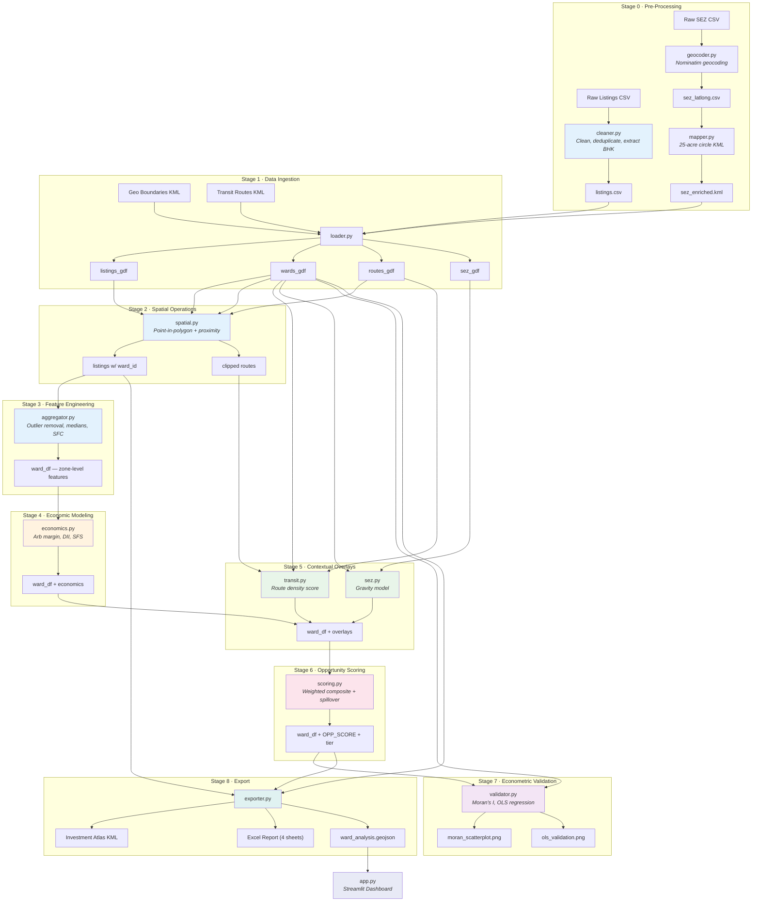

# 🔍 Flent Lens

> **Navigate India's Co-Living Arbitrage Market**

*A spatial-economic analysis pipeline + interactive dashboard that identifies geographic zones with maximum per-room arbitrage margin, convertible 3BHK+ supply, and strongest co-living demand — built for Flent's investment decision-making.*

---

**Team:** Harshith Bejjanki `SM24UBBA047` · Suneeth Boorgula `SM24UBBA016` · Sudhiksha `SM24UBBA033` · Peddi Sudeeksha `SM24UBBA027` · Vedanth Nagaarur `SM24UBBA019`

---

## Key Project Assumptions

The Flent Lens analytical model is built upon the following core business and spatial-economic assumptions.

> [!IMPORTANT]
> **1. Rental Arbitrage Logic**: Flent does NOT buy properties; it leases large 3BHK+ units at "wholesale" rates and converts them into "retail" co-living rooms.
>
> **2. Wholesale Sourcing (Q1)**: Acquisition pricing is anchored to the **25th percentile (Q1)** of market rent, reflecting Flent's ability to negotiate for distressed or bulk inventory.
>
> **3. Retail Revenue Anchor**: Per-room revenue is capped at **80% of the ward median 1BHK rent** (0.80 Demand Discount Factor). This ensures rooms are always a better value proposition than standalone apartments.
>
> **4. Space Optimization (Dynamic Yield)**: The number of revenue rooms depends on the total square footage (e.g., 3 rooms for standard 3BHKs, 4 rooms for XL units ≥2,000 sqft).
>
> **5. Viability Pillars**: A zone is only investable if it yields an arbitrage margin **>₹5,000/month** and has a supply depth of **>3 listings**.
>
> **6. Spatial Spillover (Aura Effect)**: Co-living demand is contagious. Wards adjacent to Tier 1 clusters receive a scoring boost, while isolated high-performing wards are penalized (Island Penalty).
>
> **7. Transit as a Penalty**: Unlike traditional real estate, high bus/transit density is weighted negatively (-0.10) to account for noise, congestion, and the "premium" positioning of Flent properties.

---

## Limitations & Caveats

* Single data source — Magicbricks only. Cross-platform validation would improve robustness.
* No time-series — Rent trends and vacancy rates are not captured.
* Transit = bus only — Metro and suburban rail are not modelled.
* Ward centroid simplification — SEZ distances are measured from ward centroids, not boundaries.
* Static demand discount — The 0.80 DDF is assumed uniform (with ±10% local elastic band), but actual co-living pricing may vary by property, furnishing quality, and brand positioning.
* No capex modelling — Furnishing costs, security deposits, and setup capital are not included in the margin calculation.

---

## The Research Question

> **Which areas offer the most favourable combination of factors for Flent — maximum per-room arbitrage margin, highest availability of convertible 3BHK+ properties, and strongest demand for shared living in premium furnished rooms?**

This pipeline answers that question rigorously — with real Magicbricks rental data, geographic boundary geometry, transit routes, and SEZ employment zones — producing a ranked, tiered investment target list for Flent's co-living expansion across multiple cities.

---

## The Business Logic

Flent's model is a **rental arbitrage operation**:

1. **Lease** a large 3BHK+ apartment at the zone's market rent
2. **Convert** it into premium furnished co-living rooms
3. **Earn** the spread between per-room revenue and the master lease cost

Three pillars determine zone viability:

| Pillar | Signal | Threshold |
|--------|--------|-----------|
| **Arbitrage Margin** | `(avg_rent_1bhk × rooms × discount) − avg_rent_3bhk` | > ₹5,000/month |
| **Supply Depth** | Count of 3BHK+ listings ≥ 1,100 sqft | > 3 per zone |
| **Demand Intensity** | Price pressure + small-flat concentration + PSF spread | Composite 0–1 index |

---

## Quick Start

```bash
# 1. Activate virtual environment
source venv/bin/activate         # macOS / Linux

# 2. Run the full analysis pipeline (for active city)
python main.py

# 3. Launch the Interactive Dashboard
streamlit run app.py
# → Opens http://localhost:8501 in your browser
```

---

## Project Structure

```
BBA_Python_final/               ← Flent Lens project root
│
├── main.py                     ← Pipeline orchestrator (run this directly)
├── config.py                   ← ALL paths, weights, and thresholds (source of truth)
├── city_config.py              ← Multi-city profiles (Bangalore, Hyderabad)
├── app.py                      ← Streamlit dashboard (new)
├── requirements.txt            ← Python dependencies
│
├── data/
│   ├── raw/
│   │   ├── bangalore/
│   │   │   ├── magicbricks_final_listings.csv
│   │   │   ├── gba-369-wards-december-2025.kml
│   │   │   ├── bmtc_bus_routes.kml
│   │   │   └── SEZ List/
│   │   └── hyderabad/
│   │       ├── magicbricks_final_listings_hyderabad.csv
│   │       └── Hyderabad Pincode Map.kml
│   └── processed/                    ← Auto-generated intermediates
│       ├── bangalore/
│       └── hyderabad/
│
├── src/
│   ├── pipeline/               ← Pre-processing stages
│   │   ├── cleaner.py          ← Magicbricks cleaning, BHK extraction, dedup
│   │   ├── geocoder.py         ← SEZ geocoding via Nominatim API
│   │   └── mapper.py           ← SEZ 25-acre circle KML generation
│   │
│   ├── modules/                ← Core analytical engine
│   │   ├── loader.py           ← Data I/O, schema validation, KML parsing
│   │   ├── spatial.py          ← Point-in-polygon joins, route intersection
│   │   ├── aggregator.py       ← Outlier removal, ward-level statistics
│   │   ├── economics.py        ← Arbitrage margin, DII, SFS, margin density
│   │   ├── transit.py          ← Transit connectivity index
│   │   ├── sez.py              ← SEZ gravity model (employment proximity)
│   │   ├── scoring.py          ← Composite opportunity score + tier assignment
│   │   └── validator.py        ← Moran's I + OLS regression
│   │
│   └── utils/
│       ├── logger.py           ← Rich terminal UI (banners, stages, metrics)
│       └── exporter.py         ← KML atlas, XLSX report, GeoJSON export
│
└── output/                     ← Generated deliverables
    ├── bangalore/
    │   ├── flent_investment_atlas.kml
    │   ├── flent_lens_report.xlsx
    │   ├── ward_analysis.geojson
    │   ├── 3bhk_supply_price_quartiles.xlsx
    │   ├── moran_scatterplot_avg_rent_1bhk.png
    │   └── ols_arbitrage_validation.png
    └── hyderabad/
        └── (same structure)
```

---

## Pipeline Architecture



---

## The Dashboard

The **Streamlit Dashboard** (`app.py`) is the primary interface for exploring, comparing cities, and understanding the analysis.

```bash
streamlit run app.py
# Opens http://localhost:8501
```

### Key Features

| Feature | Description |
|---------|-------------|
| **City Switcher** | Toggle between Bangalore and Hyderabad in the sidebar |
| **Pipeline Execution** | Run the pipeline directly from the dashboard with live log streaming |
| **Top 3 Ward Cards** | Detailed economic snapshot cards mirroring the KML atlas popups |
| **Opportunity Atlas** | Interactive choropleth map with hover tooltips for every zone |
| **Economic Analysis** | Margin vs rent scatter plot with full ward economics table |
| **Statistical Validation** | OLS regression + Moran's I results with plain-English interpretations |
| **Data Export** | Browse Excel sheets and download raw report files |

---

## Pipeline Stages

```bash
python main.py
```

The pipeline runs **8 stages** with a narrative terminal UI:

| Stage | Name | Description |
|-------|------|-------------|
| 0 | Data Pre-Processing | Clean Magicbricks CSV, geocode SEZs, generate KML geometries |
| 1 | Data Ingestion | Load core datasets: listings, geo boundaries, bus routes, SEZ points |
| 2 | Spatial Operations | Point-in-polygon zone assignment with proximity fallback, route clipping |
| 3 | Feature Engineering | Outlier removal (σ-based), zone-level median rents, SFC, PSF spread |
| 4 | Economic Modeling | Arbitrage margin (3BHK/4BHK), DII, SFS, effective margin density |
| 5 | Contextual Overlays | Transit score (route density + length), SEZ gravity score |
| 6 | Opportunity Indexing | Composite score, spatial spillover / island penalty, tier assignment |
| 7 | Econometric Validation | Moran's I spatial autocorrelation + Hedonic OLS regression |
| 8 | Export & Delivery | KML atlas, 4-sheet XLSX report, GeoJSON for dashboard |

Stages are **skipped automatically** if cached files already exist.

---

## Output Files

| File | Description |
|------|-------------|
| `flent_investment_atlas.kml` | Open in Google Earth — zone polygons + listing pins in layered format |
| `flent_lens_report.xlsx` | 4 sheets: Executive Summary, Full Data, Score Breakdown, OLS Model |
| `ward_analysis.geojson` | Full ward dataset for dashboard map + QGIS / web mapping |
| `3bhk_supply_price_quartiles.xlsx` | 3BHK rent quartile breakdown per zone |
| `moran_scatterplot_*.png` | Spatial autocorrelation diagnostic |
| `ols_arbitrage_validation.png` | OLS regression validation plot |

---

## Methodology

### 1. Arbitrage Margin

The core revenue model finds the spread between what Flent pays to lease a 3BHK and what it earns splitting it into rooms.

```
per_room_revenue  = city_median_rent_1bhk × DEMAND_DISCOUNT_FACTOR (0.80)
arb_margin_3bhk   = (per_room_revenue × 3) − q25_rent_3bhk
arb_margin_4bhk   = (per_room_revenue × 4) − q25_rent_4bhk
arb_margin_best   = max(arb_margin_3bhk, arb_margin_4bhk)
```

**Acquisition cost** uses the **25th percentile** (distressed/bulk inventory Flent targets).
**Revenue** uses the **50th percentile** (median market rate Flent charges per room).
The **0.80 demand discount factor** reflects tenants accepting a 20% discount vs solo 1BHK renting, in exchange for premium furnishing and zero hassle.

### 2. Dynamic Yield Model

Flat size determines how many revenue rooms Flent can extract:

| Size Range | BHK | Revenue Rooms |
|---|---|---|
| < 1,400 sqft | 3BHK | 3 rooms |
| 1,400–1,600 sqft | 3BHK | 3.5 rooms |
| ≥ 1,600 sqft | 3BHK | 4 rooms |
| ≥ 2,000 sqft | 4BHK | 5 rooms |

### 3. Demand Intensity Index (DII)

```
DII = w₁ × norm(price_pressure)  +  w₂ × norm(sfc)  +  w₃ × norm(psf_spread)

price_pressure = median_rent_1bhk / city_median_1bhk
sfc            = (cnt_1bhk + cnt_2bhk) / total_listings
psf_spread     = (max_psf − min_psf) / median_psf
```

Weights: `0.40 / 0.30 / 0.30` (configurable in `config.py`).

### 4. Supply Feasibility Score (SFS)

```
SFS = w₁ × norm(supply_volume)  +  w₂ × norm(size_adequacy)  +  w₃ × norm(roi_score)

supply_volume = log1p(cnt_3bhk + cnt_4bhk) / log1p(city_max)
size_adequacy = pct_3bhk_listings ≥ MIN_SQFT_3BHK
roi_score     = arb_margin_best / max(arb_margin_best_citywide)
```

Weights: `0.35 / 0.30 / 0.35` (configurable in `config.py`).

### 5. Composite Opportunity Score

```
ECON_SCORE  = (arb_margin_pct × 0.45) + (DII × 0.30) + (SFS × 0.25)
OPP_SCORE   = ECON_SCORE + (transit_score × 0.10) + (sez_score × 0.20)
```

Overlay weights are set to 0 automatically when transit/SEZ data is unavailable for a city.

### 6. Spatial Spillover (Neighborhood Contagion)

A Tier 1 zone in a cluster of strong neighbouring zones is more investable than an isolated one:

- **Tier 1 neighbor:** +10% `OPP_SCORE` boost
- **Tier 2 neighbor:** +5% boost
- **Tier 3 neighbor:** +2.5% boost
- **Island penalty:** −15% for Tier 1 zones with zero Tier 1/2 neighbors

### 7. Tier Assignment

Tiers are assigned on **percentile bands of eligible zones only** (zones where `margin_viable = True`):

| Tier | Percentile | Meaning |
|------|------------|---------|
| Tier 1 | ≥ 75th | Priority sourcing targets |
| Tier 2 | ≥ 50th | Secondary pipeline |
| Tier 3 | ≥ 25th | Watch list |
| Excluded | < 25th or margin not viable | Not recommended |

---

## Econometric Validation

### Moran's I — Spatial Autocorrelation
Tests whether rental prices cluster geographically. The Moran scatter plot has four quadrants:

- **HH (High–High):** High-rent zones near high-rent zones — premium rental clusters.
- **LL (Low–Low):** Low-rent zones near low-rent zones — affordable pockets.
- **LH (Low–High):** Low 1BHK rent zones surrounded by high-rent neighbours. These represent statistically proven concentrations of **arbitrage-favourable areas** — zones where acquisition cost (3BHK) is low relative to the surrounding retail rent pressure, meaning Flent can lease cheap and price rooms competitively against the more expensive adjacent market.
- **HL (High–Low):** Overpriced outliers in affordable areas — avoid.

Positive Moran's I (> 0.3, p < 0.05) confirms the spatial structure is real, not random, validating the spillover multiplier rules in the scoring model.

### Arbitrage Structural OLS
```
Q25_Acquisition_Rent_3BHK ~ Median_Retail_Rent_1BHK
```
HC3 robust standard errors. The slope coefficient β proves empirically that the 0.80 demand discount factor is structurally profitable — the mathematical breakeven discount is extracted directly from market data.

---

## Supported Cities

| City | Geo Unit | Zones | Transit | SEZ | CRS |
|------|----------|-------|---------|-----|-----|
| **Bangalore** | BBMP Ward | 369 | ✅ BMTC Routes | ✅ SEZ Gravity | EPSG:32643 |
| **Hyderabad** | Pincode Zone | 92 | — | — | EPSG:32644 |

To add a new city: add a profile to `city_config.py`, provide raw data files, and set `ACTIVE_CITY`.

---

## Key Configuration Parameters

All parameters live in `config.py`. Key ones:

| Parameter | Default | Purpose |
|-----------|---------|---------|
| `DEMAND_DISCOUNT_FACTOR` | `0.80` | Per-room rent as % of standalone 1BHK |
| `MARGIN_VIABLE_PCT` | `0.05` | Minimum margin % to qualify as viable |
| `OUTLIER_STD_THRESHOLD` | `3.0` | Std devs for outlier removal |
| `MIN_LISTINGS_PER_BHK` | `3` | Min listings per BHK type for reliability |
| `MAX_VALID_1BHK_RENT` | `₹50,000` | Cap on valid 1BHK rent data |
| `MIN_SQFT_3BHK` | `1,100` | Minimum sqft for 3BHK conversion |
| `ECON_WEIGHT_ARBITRAGE` | `0.45` | Composite score weight for arbitrage |
| `ECON_WEIGHT_DII` | `0.30` | Composite score weight for demand |
| `ECON_WEIGHT_SFS` | `0.25` | Composite score weight for supply |
| `OVERLAY_WEIGHT_TRANSIT` | `0.10` | Score weight for transit connectivity |
| `OVERLAY_WEIGHT_SEZ` | `0.20` | Score weight for SEZ proximity |
| `TIER1_PERCENTILE` | `75` | Percentile cutoff for Tier 1 |
| `SPILLOVER_BOOST_TIER1` | `1.10` | Aura boost from Tier 1 neighbors |
| `ISOLATION_PENALTY` | `0.85` | Penalty for isolated high-score zones |

---

## Tech Stack

| Library | Role |
|---------|------|
| `pandas` | DataFrame operations |
| `geopandas` | Spatial joins & CRS projections |
| `fiona` | KML file I/O |
| `shapely` | Geometry operations |
| `scikit-learn` | Min-max normalization |
| `statsmodels` | OLS regression + HC3 errors |
| `libpysal` | Spatial weights (Queen contiguity) |
| `esda` | Moran's I statistic |
| `matplotlib` / `seaborn` | Validation plots |
| `rich` | Narrative terminal UI |
| `geopy` | SEZ geocoding via Nominatim |
| `openpyxl` | XLSX export with conditional formatting |
| `streamlit` | Interactive dashboard |
| `plotly` | Choropleth map + charts |

---

## Common Errors & Fixes

| Error | Cause | Fix |
|-------|-------|-----|
| `ModuleNotFoundError` | Dependency not installed | Run `pip install -r requirements.txt` |
| `CRSError` on spatial join | CRS mismatch between GDFs | Auto-projected to EPSG:4326 before joins |
| All zones `data_sparse` | Lat/lon swapped in CSV | Check column names in raw CSV |
| `KML layer not found` | Missing KML layer | Run `fiona.listlayers('file.kml')` to inspect |
| Moran's I `island error` | Isolated polygon | `Queen(silence_warnings=True)` is default |
| Dashboard shows `—` metrics | GeoJSON not generated | Run pipeline once via sidebar button |

---

*Flent Lens — BBA Python Project, April 2026*
