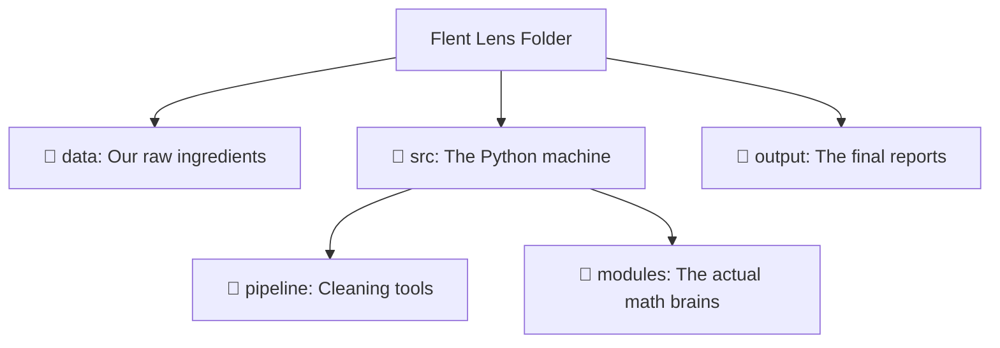
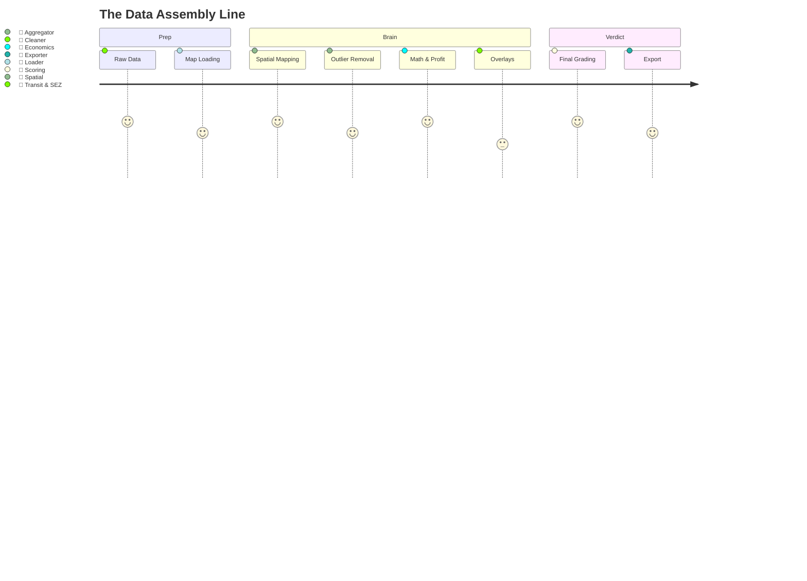

# 📘 Flent Lens: A Simple Business Overview
*The "Plain English" Guide to Our Co-Living Arbitrage Tool*

Welcome to the **Flent Lens** project! If you aren't a Python coder, don't worry. This document explains exactly what the program does, how it thinks, and what the final outputs mean. 

---

## 🎯 1. The Question We Are Trying to Answer

Flent's business involves **rental arbitrage**: we lease large empty properties (like 3BHKs or 4BHKs), convert them into fully furnished premium single rooms (co-living), and rent out each room individually. 

The essential question this program answers is:
> **"Which specific neighborhoods (wards) will make Flent the most money right now, by having the biggest gap between large-flat lease costs and single-room revenues, while showing the healthiest stream of tenant demand?"**

---

## 🧠 2. Core Business Assumptions (The "Rules of the Game")

The program makes a few crucial real-world assumptions to calculate "potential profit":

1. **The 25th Percentile Acquisition Rule**: We don't want to pay the "median" or "average" rent for a 3BHK. Our acquisition team looks for slightly distressed, bulk, or lower-priced inventory. The model assumes we will sign a lease at the **bottom 25% price range** in any neighborhood.
2. **The 50th Percentile Revenue Rule**: For the rooms we rent out, we assume we can charge the **average (median)** rent of a standalone 1BHK in that same city. 
3. **The Demand Discount**: Tenants choose Flent because it's easier and cheaper than renting an entire 1BHK alone. We assume they expect roughly a **20% discount** compared to a standalone 1BHK. (So we multiply the standard 1BHK rate by 0.80).
4. **Dynamic Yield**: Large 3BHKs (above 1,600 sq.ft) have extra space (like server rooms or long living halls) that can be converted. The model assumes a standard 3BHK yields **3 rooms**, but a large one yields **4 rooms**.

---

## 🗺️ 3. Project Structure: A Bird's-Eye View

Here is how the project folders are organized, laid out simply:

- **`data/`**: Where we put the raw CSV files (property listings) and KML files (maps/boundaries).
- **`src/`**: The code. It's split into `pipeline` (makes the data neat) and `modules` (does the math).
- **`output/`**: Where the program drops the final Excel files and visual maps for leadership.
- **`config.py`**: The "Control Center". This file holds all our weights, sliders, and percentages. 

---

## ⚙️ 4. The Modules (How The Machine Works)

Below is the step-by-step assembly line of how data moves through our system.

### Module 1: `cleaner.py` (The Bouncer)
* **What it is:** The security check at the door.
* **Inputs:** The messy, raw scrape of Magicbucks property data. 
* **Calculations:** Checks if properties actually exist, tries to extract "BHK" numbers from paragraph descriptions if they are missing, and throws out listings with fake prices (e.g., a 1BHK listed for ₹5 Lakhs/month).
* **Outputs:** A clean, trustworthy list of properties.
* **Tools Used:** Pandas (Data tables), Regex (Text-searching tools).

### Module 2: `loader.py` (The Librarian)
* **What it is:** Grabs the clean property data, the map boundaries (wards/pincodes), the bus routes, and tech park (SEZ) locations and brings them into the program's memory.
* **Inputs:** The clean CSV from `cleaner.py` and KML map files.
* **Outputs:** Organized geo-spatial tables ready to be layered on top of each other.

### Module 3: `spatial.py` (The Mapper)
* **What it is:** The geographer. 
* **Calculations:** It answers the question, *"Which neighborhood does this property belong to?"* It uses GPS coordinates to drop a "pin" for every property and checks which ward boundary polygon it falls into. 
* **Outputs:** Every listing now has a "Ward Name" attached to it.

### Module 4: `aggregator.py` (The Summarizer)
* **What it is:** The accountant who rolls up all the individual property data into neighborhood scorecards.
* **Calculations:** Removes any remaining extreme outliers, then calculates the "Medians." E.g., *"What is the median 1BHK rent in Ward A? How many 3BHKs are available in Ward B?"*
* **Outputs:** A rolled-up table where each row is a neighborhood (ward).

### Module 5: `economics.py` (The Profit Calculator)
* **What it is:** The core business brain.
* **Inputs:** The neighborhood scorecards.
* **Calculations:** 
  - **Arbitrage Margin**: (Expected revenue per room × rooms) − expected 3BHK acquisition cost.
  - **Capital Efficiency (ROI)**: Margin divided by capital deployed. 
  - **Demand Check**: Checks if 1BHK rents are high in this area (indicating people want to live there).
* **Outputs:** Tells us the ₹/month profit edge per neighborhood, and flags wards that are "Viable" (profitable) or "Not Viable".

### Module 6: `scoring.py` (The Grader)
* **What it is:** The final judge. 
* **Calculations:** Takes the profit (Arbitrage), demand, supply health, transit lines, and SEZ proximity and turns it into one **Composite Opportunity Score (0 to 100)**. 
  - **Spatial Spillover (Aura)**: Also checks if a ward is physically touching a highly profitable ward. If it is next to a goldmine, it gets a small score boost.
* **Outputs:** Each ward gets a Tier badge: **Tier 1 (Best), Tier 2 (Good), Tier 3 (Watch), or Excluded**.

---

## 📊 5. How to Read the Results

When the program finishes, you will receive two vital files in the `output/` folder. Here is how you use them.

### A. The Excel Report (`flent_lens_report.xlsx`)
This is designed for business leadership. Open it in Microsoft Excel or Google Sheets.

* **Sheet 1: Executive Summary**: Gives you the top 10 recommended wards to attack immediately, showing the expected profit per property.
* **Sheet 2: Full Data**: A detailed breakdown of every neighborhood in the city. If you want to know *why* a specific ward failed, search for it here. Check its "Margin Viable" column (True/False) to see if the base prices made sense. 
* **Sheet 3: Score Breakdown**: Shows exactly how the 100-point score was achieved. (e.g., Did it win because of high profit, or because of great transit?)

### B. The Map (`flent_investment_atlas.kml`)
This is the visual strategy map. 

1. Download the free program **Google Earth Pro** (Desktop) or go to Google Earth Web.
2. Drag and drop the `flent_investment_atlas.kml` file into the program.
3. **What you'll see:** The entire city will be divided into colored blocks (wards).
   * **🟢 Green (Tier 1)**: Immediate focus for the acquisition team. High profit, high demand. 
   * **🟡 Yellow/Orange (Tier 2/3)**: Secondary options. 
   * **⚪ Gray/Clear (Excluded)**: Ignore these neighborhoods; the math doesn't support our business model here.
4. **Click on a Neighborhood**: A scorecard pop-up will appear displaying the neighborhood's profit margin, dominant property types, and transit scores!

---
*Created for the Flent Acquisition & Leadership Teams. No code required.*
